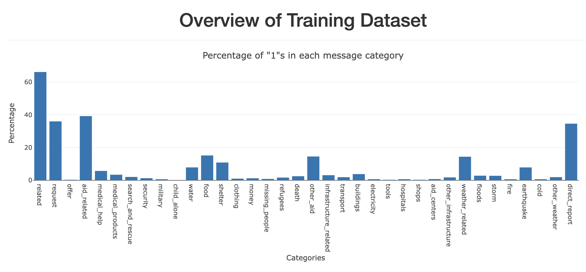

# Disaster-Response-Pipeline

### Table of Contents

1. [Project Motivation](#motivation)
2. [File Descriptions](#files)
3. [Acknowledgements](#licensing)

## Project Motivation<a name="motivation"></a>

In this project, we analyzed disaster data from [Appen](https://appen.com/) to build a model for an API that classifies disaster messages. We utilized the provided data set containing real messages that were sent during disaster events. We created a machine learning pipeline to categorize these events so that we can send the messages to an appropriate disaster relief agency. Our project included a web app where an emergency worker can input a new message and get classification results in several categories.

A screenshot of the query result for message "We are more than 50 people sleeping on the street. Please help us find tent, food." is as follows:


The web app also displayed visualizations of Percentage of "1"s in each of the 36 categories, from which we can visualize how imbalanced each category is, and thus have a reasonable expectation of the performance of the classification.




## File Descriptions <a name="files"></a>

- #### Input data files:
The `data` folder contains the messages and categories datasets `disaster_categories.csv` and `disaster_messages.csv`. We merged the two datasets, cleaned the data, and finally stored it into a SQLite database. Later we use this data to train and test our machine learning model.

- #### Program files:

  - First run the ETL script `process_data.py` to generate machine learning used data, for which one needs to run the command below in the terminal:
```
python process_data.py disaster_messages.csv disaster_categories.csv DisasterResponse.db
```

    The script takes `disaster_messages.csv` and `disaster_categories.csv` as inputs, merges them into one dataset and cleans the dataset, and stores the clean data into a SQLite database `DisasterResponse.db`.

  - Then run the following machine learning script `train_classifier.py` in the terminal:
```
python train_classifier.py ../data/DisasterResponse.db classifier.pkl
```
The script takes `DisasterResponse.db` as input, builds and trains a classifier, and stores the classifier into a pickle file `classifier.pkl`.

  - Finally the deployment script `run.py` is used to start an web app, when a user inputs a message into the app, the app returns classification results for all 36 categories. The main page also includes some visualizations about the data. The webpage can be opened using local IP http://10.0.0.29:3001/.


## Acknowledgements<a name="licensing"></a>

Thanks for this project from the Udacity Data Science Nanodegree program.
